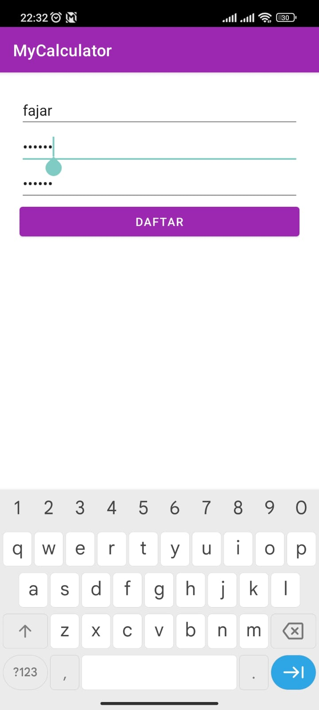
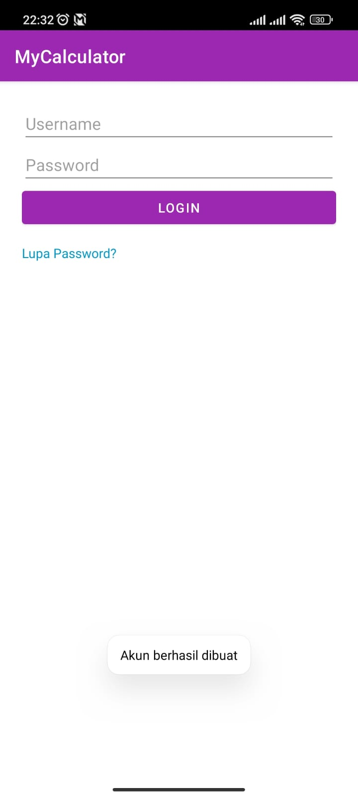

# My Calculator 📱

A simple Android calculator app built with Kotlin and Android Studio.

---

## ✨ Features

- Basic arithmetic operations: Addition (+), Subtraction (−), Multiplication (×), Division (÷)
- Custom UI with rounded buttons
- Real-time expression evaluation using [`exp4j`](https://www.objecthunter.net/exp4j/)
- User-friendly interface optimized for mobile screens
- Login and Register features
- Local storage with SharedPreferences


---

## 📸 Screenshots

### Register


### Login
   

### Home Screen


### Calculation Result


---

## 🧰 Tech Stack

| Stack        | Detail                      |
|--------------|-----------------------------|
| Language     | Kotlin                      |
| Framework    | Android SDK                 |
| IDE          | Android Studio              |
| Expression Parser | [`exp4j`](https://www.objecthunter.net/exp4j/) |

---

## 📦 Installation

1. Clone this repository:
   ```bash
   git clone https://github.com/hexatod/My-Calculator.git
   
## Testcase Documentation
   ```bash
- [📄 Test Cases](./QA_Documents/testcase.xlsx)
